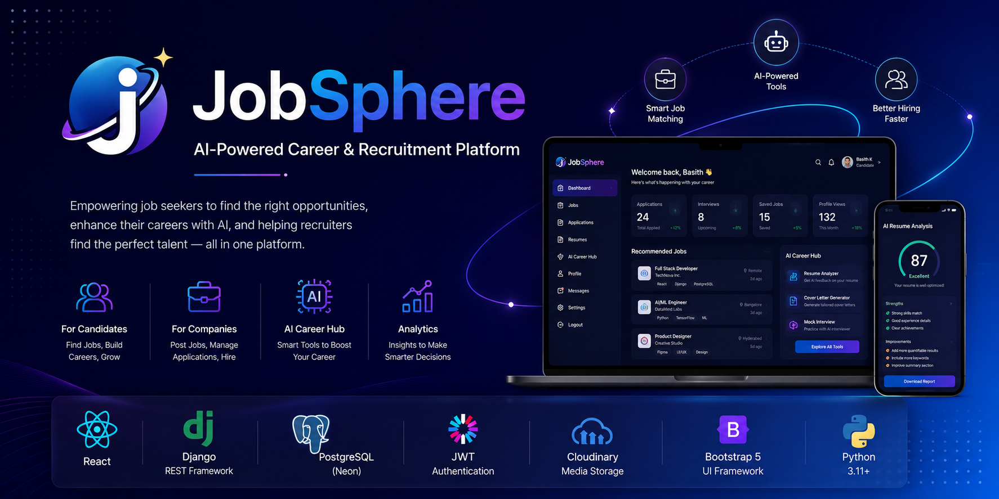
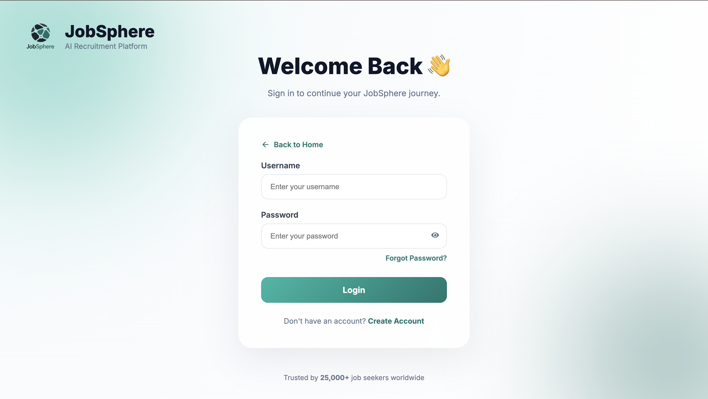
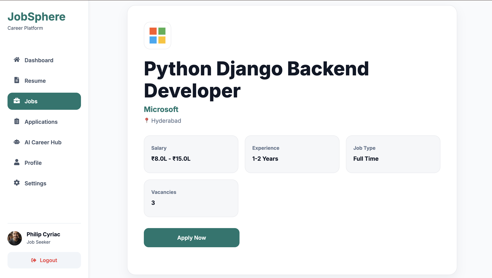
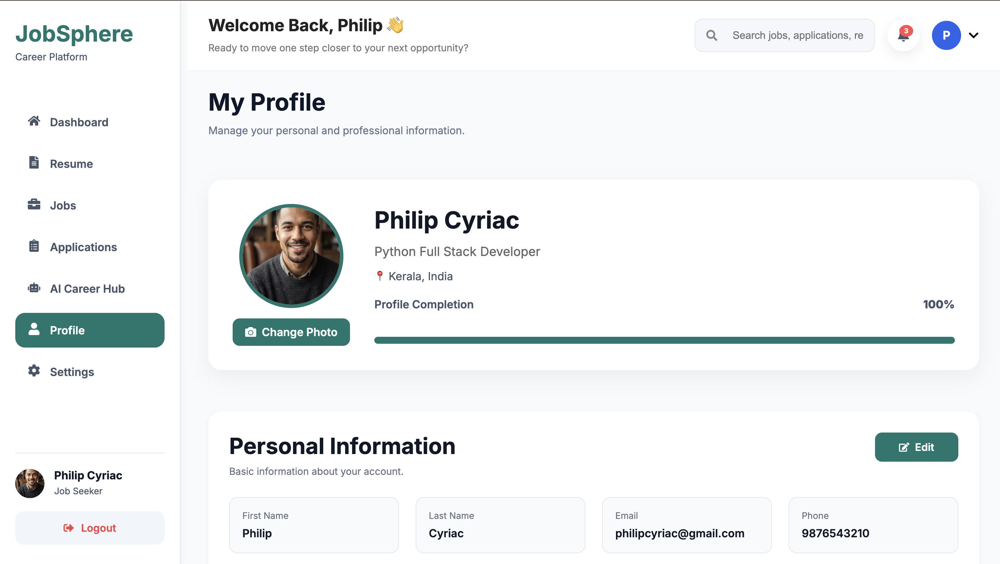
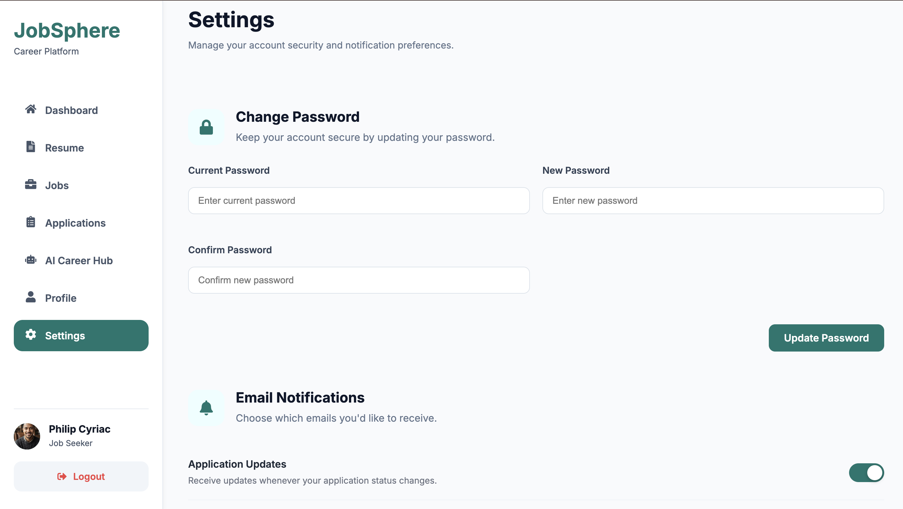
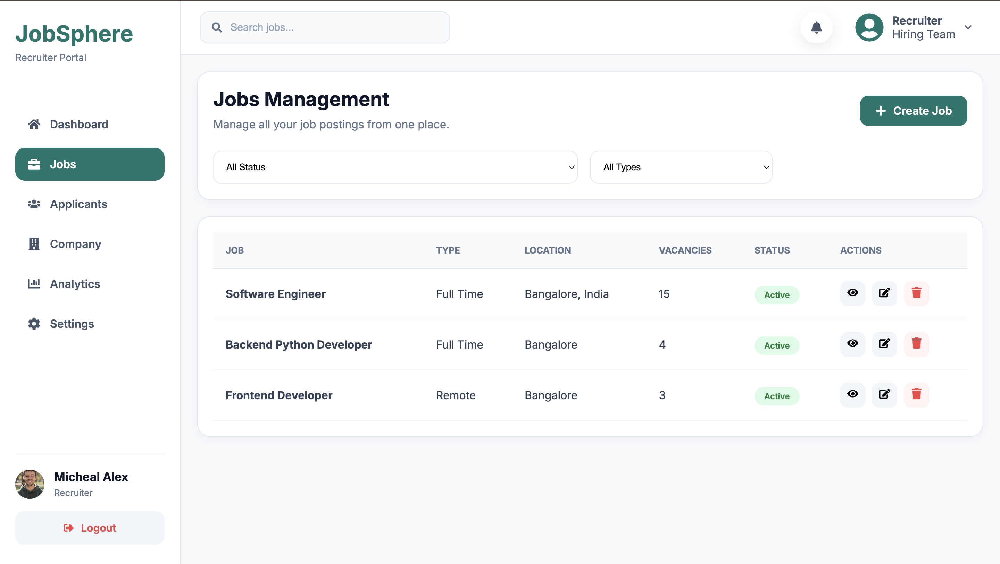

<p align="center">
  
</p>

<h1 align="center">🚀 JobSphere</h1>

<p align="center">
AI-Powered Career & Recruitment Platform
</p>

<p align="center">
A modern full-stack recruitment platform that connects job seekers and recruiters with AI-powered resume analysis, cover letter generation, mock interviews, and seamless hiring workflows.
</p>

---

<p align="center">


</p>
<p align="center">

⭐ AI Career Hub • 💼 Job Portal • 🔐 JWT Authentication • ☁️ Cloudinary • 🚀 Production Ready

</p>

---

# 🧩 Core Modules

### 👨‍🎓 Candidate Portal

- Register & Login
- Browse Jobs
- Apply for Jobs
- Resume Management
- AI Career Hub
- Profile Management

### 🏢 Recruiter Portal

- Company Registration
- Job Posting
- Candidate Management
- Application Tracking
- Dashboard Analytics

### 🤖 AI Career Hub

- ATS Resume Analysis
- Resume Skill Extraction
- AI Resume Feedback
- AI Cover Letter Generator
- AI Mock Interview

---

## 🌐 Live Demo

| Platform | Link |
|----------|------|
| 🌐 Live Website | https://job-sphere-chi.vercel.app |
| ⚙️ Backend API | https://jobsphere-api-udpb.onrender.com |

---

## 📸 Project Preview


---

# 🎯 Why JobSphere?

JobSphere is an AI-powered recruitment platform designed to simplify the hiring process for both candidates and recruiters.

It combines traditional job portal functionality with intelligent career tools such as:

- ATS Resume Analysis
- AI Resume Feedback
- AI Cover Letter Generation
- AI Mock Interviews
- Resume Skill Extraction

The platform demonstrates a production-ready full-stack architecture using React, Django REST Framework, PostgreSQL, JWT Authentication, Cloudinary, and modern deployment practices.

---
## ✨ Features

### Candidate

-   JWT Authentication
-   Dashboard
-   Job Search
-   Resume Manager
-   Notifications

### Company

-   Company Dashboard
-   Job Management
-   Analytics

### AI Career Hub

-   ATS Resume Analysis
-   AI Resume Review
-   AI Cover Letter Generator
-   AI Mock Interview
-   Resume Skill Extraction

---

## 🛠 Tech Stack

  Category     Technology
  ------------ -------------------------
  Frontend     React, Bootstrap, Axios
  Backend      Django REST Framework
  Database     PostgreSQL (Neon)
  Storage      Cloudinary
  Deployment   Vercel, Render

---

# 📊 Project Highlights

| Feature | Status |
|----------|--------|
| 🔐 JWT Authentication | ✅ |
| 👥 Role-Based Access | ✅ |
| 💼 Job Management | ✅ |
| 📄 Resume Management | ✅ |
| 🤖 AI Resume Analyzer | ✅ |
| ✍️ AI Cover Letter Generator | ✅ |
| 🎤 AI Mock Interview | ✅ |
| ☁️ Cloudinary Storage | ✅ |
| 📱 Responsive Design | ✅ |
| 🚀 Production Deployment | ✅ |


---

## 📂 Project Structure

``` text
JobSphere/
├── backend/
├── frontend/
├── docs/
│   ├── screenshots/
│   ├── architecture/
│   └── api/
├── README.md
└── LICENSE
```

---

# 🏗️ System Architecture

```text
                +----------------------+
                |      React App       |
                |   (Frontend - Vite)  |
                +----------+-----------+
                           |
                      Axios API
                           |
                           ▼
                +----------------------+
                | Django REST API      |
                | JWT Authentication   |
                +----------+-----------+
                           |
        +------------------+------------------+
        |                                     |
        ▼                                     ▼
+--------------------+             +------------------+
| PostgreSQL (Neon)  |             | Cloudinary       |
| Users, Jobs, Apps  |             | Resume Storage   |
+--------------------+             +------------------+
                           |
                           ▼
                 +----------------------+
                 | AI Career Hub        |
                 | Resume Analysis      |
                 | Cover Letters        |
                 | Mock Interviews      |
                 +----------------------+
```

---

# 📸 Application Gallery

## 🏠 Homepage & Authentication

| Homepage | Login |
|----------|-------|
|  |  |

---

## 👤 Candidate Experience

| Dashboard | Job Search |
|-----------|------------|
|  |  |

| Job Details | Resume Manager |
|-------------|----------------|
|  |  |

| Candidate Profile | Settings |
|-------------------|----------|
|  |  |

---

## 🤖 AI Career Hub

| AI Resume Analysis | Cover Letter Generator |
|--------------------|------------------------|
|  |  |

| AI Mock Interview |
|-------------------|
|  |

---

## 🏢 Recruiter Dashboard

| Company Dashboard | Job Management |
|-------------------|----------------|
|  |  |

---

# 📡 REST API

| Module | Endpoint |
|---------|----------|
| Authentication | `/api/token/` |
| Users | `/api/users/` |
| Companies | `/api/companies/` |
| Jobs | `/api/jobs/` |
| Applications | `/api/applications/` |
| Resume | `/api/resumes/` |
| AI Resume | `/api/ai-resume/` |
| AI Cover Letter | `/api/cover-letter/` |
| AI Interview | `/api/mock-interview/` |

---

## 🚀 Getting Started

Follow the steps below to run JobSphere locally for development and testing.

## ⚙ Installation

``` bash
git clone https://github.com/basith670/JobSphere.git
cd JobSphere
```

### Backend

``` bash
cd backend
python -m venv env
source env/bin/activate
pip install -r requirements.txt
python manage.py migrate
python manage.py runserver
```

### Frontend

``` bash
cd frontend
npm install
npm run dev
```

---

## 🔑 Environment Variables

### Backend

``` env
SECRET_KEY=
DEBUG=
DATABASE_URL=
CSRF_TRUSTED_ORIGINS=

CLOUDINARY_CLOUD_NAME=
CLOUDINARY_API_KEY=
CLOUDINARY_API_SECRET=

EMAIL_HOST=
EMAIL_PORT=
EMAIL_HOST_USER=
EMAIL_HOST_PASSWORD=
DEFAULT_FROM_EMAIL=
```

### Frontend

``` env
VITE_API_URL=
```

---

## 🚀 Deployment

| Component | Service |
|-----------|---------|
| Frontend | Vercel |
| Backend | Render |
| Database | Neon PostgreSQL |
| Media Storage | Cloudinary |

---

## 📈 Roadmap

-   Resume Versioning
-   AI Job Recommendations
-   Interview Scheduling
-   Email Notifications

---

## 📈 Repository Overview

- **Frontend:** React + Vite
- **Backend:** Django REST Framework
- **Database:** PostgreSQL (Neon)
- **Authentication:** JWT
- **Cloud Storage:** Cloudinary
- **Deployment:** Vercel + Render
- **Architecture:** REST API

---

## 👨‍💻 Author

**Muhammad Basith K**

🎓 B.Tech Computer Engineering

🌐 GitHub: https://github.com/basith670

💼 LinkedIn: https://www.linkedin.com/in/muhammad-basith-k-13307034b?utm_source=share_via&utm_content=profile&utm_medium=member_ios

📧 Email: basithkdrmf87@gmail.com

---

## 📄 License

This project is licensed under the **MIT License**.

---

## ⭐ Support

If you found this project helpful, please give it a ⭐ on GitHub.
