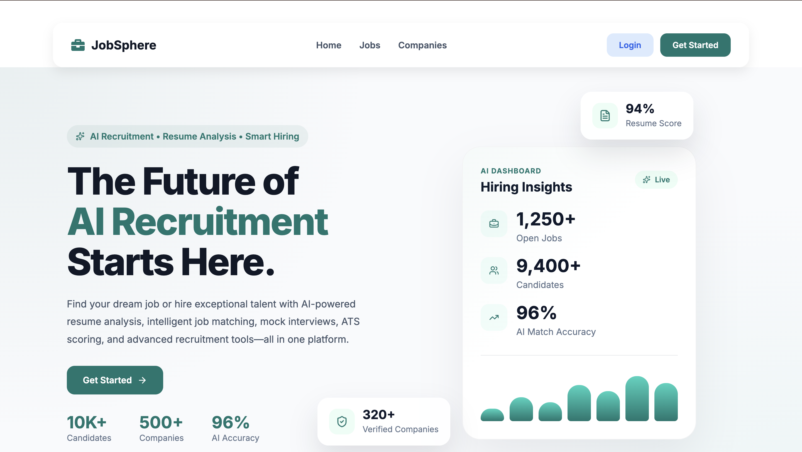
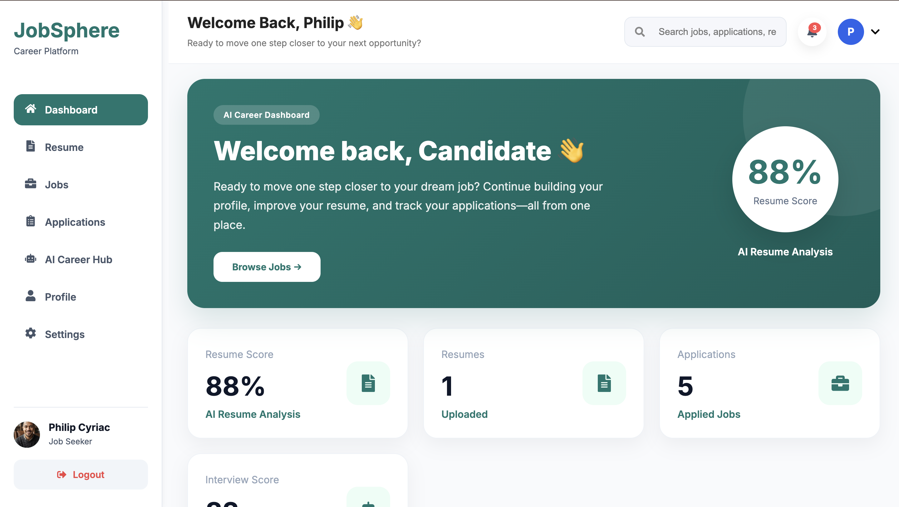
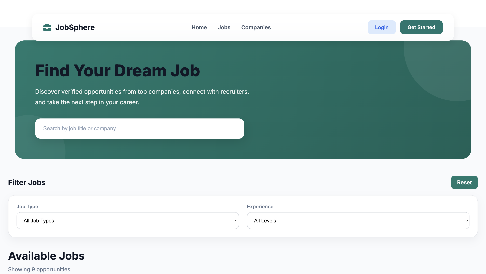
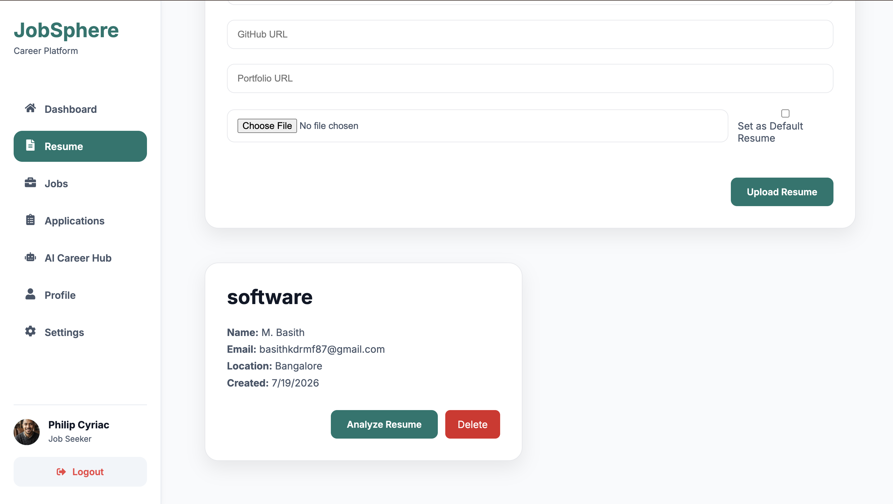
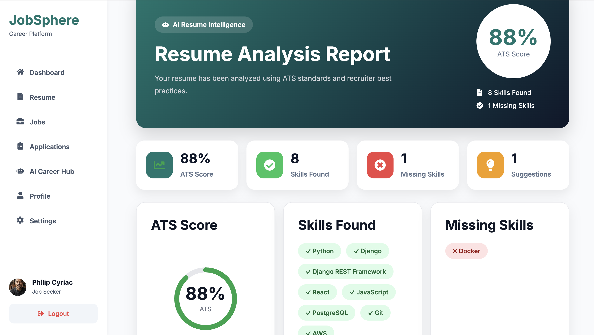
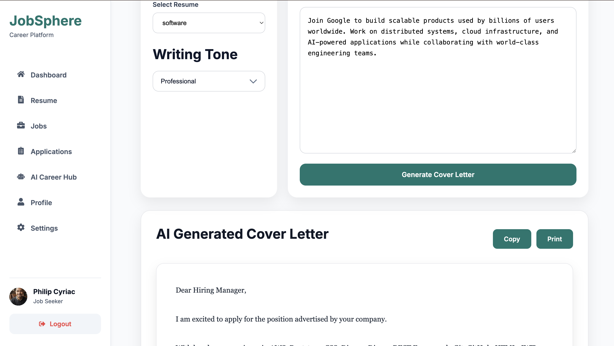
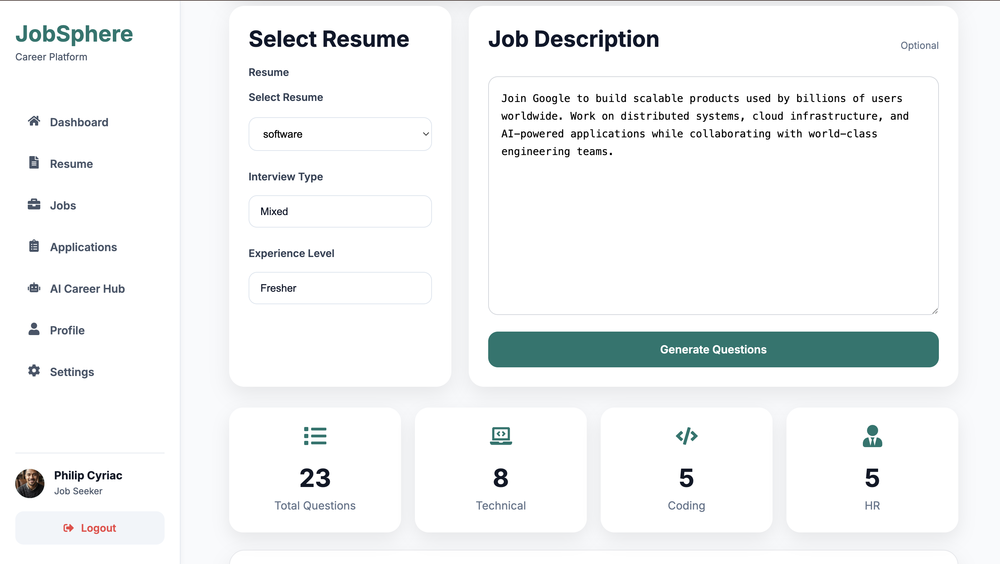
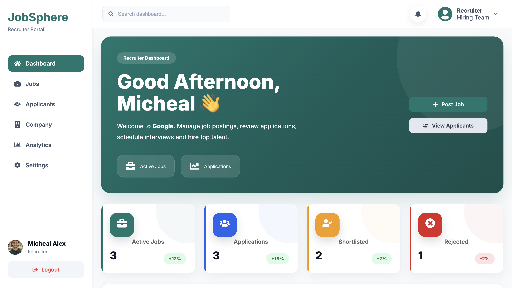

# 🚀 JobSphere

> **AI-Powered Career & Recruitment Platform**

A production-ready full-stack recruitment platform that enables candidates to discover jobs, apply for opportunities, manage resumes, generate AI-powered career documents, and prepare for interviews while helping recruiters streamline the hiring process.

---

## 🌐 Live Demo

**Frontend**

https://job-sphere-chi.vercel.app

**Backend API**

(Add your Render backend URL)

---

## 📸 Project Preview



---

## ✨ Key Features

### 👨‍💼 Candidate Features

- Secure JWT Authentication
- Candidate Dashboard
- Browse & Search Jobs
- Apply for Jobs
- Resume Management
- Profile Management
- Notifications

### 🏢 Company Features

- Company Dashboard
- Post Jobs
- Manage Applications
- Analytics Dashboard

### 🤖 AI Career Hub

- AI Resume Analyzer
- ATS Resume Score
- AI Cover Letter Generator
- AI Mock Interview
- Resume Skill Extraction

---

## 🛠 Tech Stack

| Category | Technology |
|----------|------------|
| Frontend | React, Bootstrap 5, Axios |
| Backend | Django REST Framework |
| Authentication | JWT |
| Database | PostgreSQL (Neon) |
| Media Storage | Cloudinary |
| Deployment | Vercel & Render |

---

## 📂 Project Structure

```text
JobSphere
│
├── backend
├── frontend
├── docs
│   ├── screenshots
│   ├── architecture
│   └── api
│
├── README.md
└── .gitignore
```

---

## 📷 Screenshots

### Homepage


---

### Candidate Dashboard



---

### Job Search



---

### Resume Manager



---

### AI Resume Analysis



---

### Cover Letter Generator



---

### AI Mock Interview



---

### Company Dashboard



---

## ⚙ Installation

### Clone Repository

```bash
git clone https://github.com/basith670/JobSphere.git
```

### Backend

```bash
cd backend

python -m venv env

source env/bin/activate

pip install -r requirements.txt

python manage.py migrate

python manage.py runserver
```

### Frontend

```bash
cd frontend

npm install

npm run dev
```

---

## 🔑 Environment Variables

Backend

```env
SECRET_KEY=

DATABASE_URL=

CLOUDINARY_CLOUD_NAME=

CLOUDINARY_API_KEY=

CLOUDINARY_API_SECRET=

EMAIL_HOST=

EMAIL_HOST_USER=

EMAIL_HOST_PASSWORD=
```

Frontend

```env
VITE_API_URL=
```

---

## 🚀 Deployment

Frontend

- Vercel

Backend

- Render

Database

- Neon PostgreSQL

Media

- Cloudinary

---

## 📌 Future Enhancements

- Resume Versioning
- AI Job Recommendations
- Video Interview Scheduling
- Email Notifications
- Company Verification

---

## 👨‍💻 Author

**Muhammad Basith K**

GitHub

https://github.com/basith670

LinkedIn

(Add your LinkedIn)

---

## ⭐ Support

If you found this project helpful, consider giving it a ⭐ on GitHub.